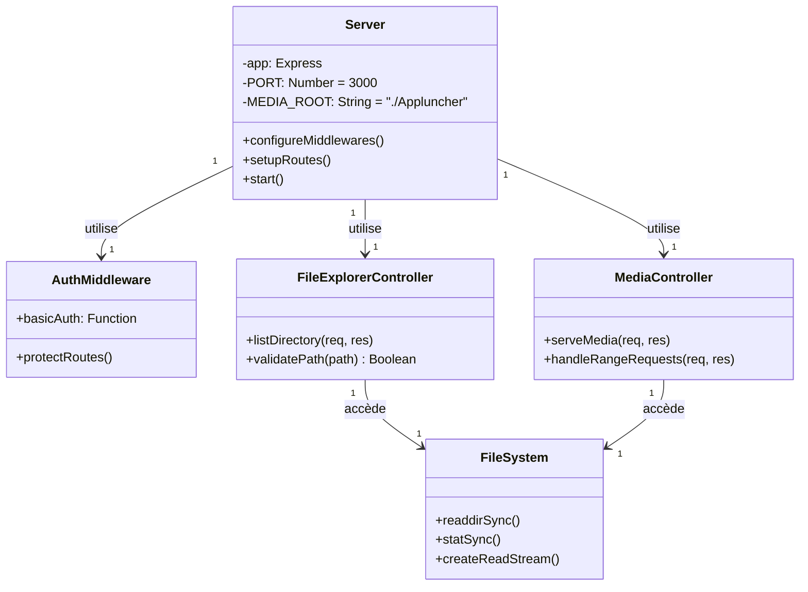

# Lecteur Média Local - Documentation

  

  

## 📌 Description

  

Application web sécurisée pour naviguer et lire des fichiers multimédias (images/vidéos) depuis un serveur local sécurisé par mot de pass

## 🚀 Fonctionnalités

  

- 🔐 **Authentification sécurisée** (Basic Auth)

- 📂 **Explorateur de fichiers** avec navigation hiérarchique

- 🖼️ **Support des images** : JPG, PNG, GIF, WebP

- 🎥 **Lecture vidéo** : MP4, WebM, MOV, AVI, MKV

- 🔍 **Recherche instantanée** dans les fichiers

- 🌗 **Thème clair/sombre** avec persistance

- 📱 **Optimisé mobile** avec gestes tactiles

- ⏯️ **Contrôles média** : précédent/suivant, plein écran

  

## 🛠️ Installation

  

  

### Prérequis

  

- Node.js v18+

  

- npm/yarn

  

  

## Étapes

  

1. Cloner le dépôt :

  

```bash

  

git  clone  https://github.com/cbaie9/media-player-node-js.git

  

cd  https://github.com/cbaie9/media-player-node-js.git

  

```

1. 1 Dépendance node js :

```bash

npm  install  express

npm  install  basic-auth

npm  install  express-basic-auth

```

  

2. Configuration des identifiants :

  

Il faut créer un fichier nommé **auth.config.js** et y inserer :

  

```bash

  

module.exports  =  {  USERNAME:  'admin',  PASSWORD:  'votre_mot_de_passe'  };

  

```

  

Il est fortement conseiller de changer le nom d'utilisateur et le mot de passe pour un mot de passe sécurisé pour éviter qu'un inconnu ou un bot puisse avoir accès à votre serveur multimédia

  

  

3. Lancer le serveur

  

Ouvrer dans le terminal la commande dans le dossier du projet

  

```bash

  

node  server.js

  

```

  

Il existe pour les utilisateur Windows un fichier **start.bat** lançant automatique le serveur et ouvrant un page web sur celui-ci

  

4. Accès au serveur/lecteur multimédia

Par défaut le serveur est héberger sur port 3000, ce port peut être changé dans le server.js dans la section pour le changer dans le port de votre choix

```bash

const  PORT  =  3000;

```

Donc le serveur sera ouvert sur ce port sur votre machine via l'adresse : ***http://localhost:3000/***

où 3000 est remplacé par le port choisie si changé

  

Vous pouvez exposé vos port au monde exterieur pour que le serveur/lecteur soit accessible a tous mais fait attention aux accès si le user/password sont faible

  

5. Configuration du contenue du lecteur

Par default le contenue visionné sera sur le dossier **\AppLuncher** et ses sous dossier

-  *Remarque* : Il faut créer le dossier sinon le server affichera un erreur sur la page web s'il n'existe pas ou qu'il n'y pas de contenue a visionner a l'intérieur

  

## Diagramme de fonctionnement :

  
